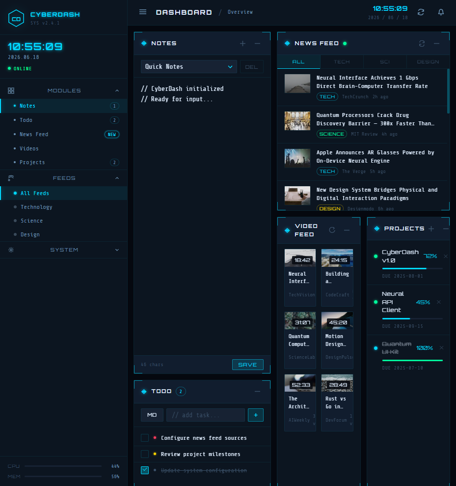

# CyberDash

A cyberpunk-themed personal dashboard — dark retrofuturistic UI with neon accents, HUD corner brackets, and five interactive widgets. Runs as a static web app served by a local Python HTTP server. No build step, no dependencies, no framework.



## Features

| Widget | Description |
|--------|-------------|
| **Notes** | Multi-note editor with localStorage persistence, char counter, new/delete/save |
| **Todo** | Task list with priority levels (high/med/low), add/complete/delete, localStorage |
| **News Feed** | 12 mock articles with category filter (Tech / Science / Design) and thumbnails |
| **Video Feed** | Carousel mode by default (fullscreen slide, prev/next, dot indicators) + grid toggle |
| **Projects** | Progress tracker with animated bars, status dots, due dates, add/delete modal |

**Sidebar:** live clock, MODULES nav (OVERVIEW · ANALYTICS · TERMINAL), FEEDS nav (NEWS · SOCIAL · MARKETS), CPU/MEM system stats (simulated), collapsible.

## Quick Start

```bash
python server.py
```

Opens `http://localhost:3000` automatically. Requires Python 3 (no other dependencies).

Alternatively serve with any HTTP server of your choice:

```bash
# Node
npx serve . -p 3000

# Python one-liner
python -m http.server 3000
```

## Project Structure

```
CYBERPUNK_DASHBOARD/
├── index.html              # Full app shell, all widget markup
├── server.py               # Python 3 dev server, auto-opens browser
├── styles/
│   ├── main.css            # Design tokens, reset, sidebar, topbar, modal
│   ├── widgets.css         # Widget grid, HUD brackets, all 5 module styles
│   └── animations.css      # @keyframes, stagger delays, .spinning utility
└── scripts/
    ├── app.js              # Clock, sidebar, nav, collapse, sys stats
    └── widgets/
        ├── notes.js        # Multi-note, localStorage, new/del/save
        ├── todo.js         # Todos, localStorage, priority, add/del/check
        ├── news.js         # News feed, category filter, refresh
        ├── videos.js       # Video cards, hover overlay, refresh
        └── projects.js     # Projects, progress bars, add modal, del
```

## Design

- **Palette:** `#05080F` deep bg · `#00D9FF` cyan neon · `#00FF9D` green · `#FF3B5C` red
- **Typography:** [Orbitron](https://fonts.google.com/specimen/Orbitron) (display) + [Share Tech Mono](https://fonts.google.com/specimen/Share+Tech+Mono) (body)
- **Signature element:** HUD corner brackets on every widget (pure CSS, 8 background-image gradients)
- **Motion:** entry animations, stagger delays, smooth progress bar transitions via `transform: scaleX()`
- **Design dials:** VARIANCE 7 · MOTION 5 · DENSITY 7

See [DESIGN.md](DESIGN.md) for the full design system reference.

## Tech Stack

| Layer | Choice |
|-------|--------|
| Markup | Vanilla HTML5 |
| Styling | Vanilla CSS3 (custom properties, grid, animations) |
| Logic | Vanilla JS (IIFE modules, DOM APIs, localStorage) |
| Server | Python 3 `http.server` |
| Fonts | Google Fonts (Orbitron + Share Tech Mono) |
| Images | [picsum.photos](https://picsum.photos) seeded placeholders |

No build step. No npm. No framework. Opens directly in any modern browser.

## Security Notes

All user-controlled content (notes, todos, project names) is rendered via `textContent` or `document.createElement` — never `innerHTML`. No external data is fetched. The news and video feeds are static mock arrays baked into the JS files.

## Roadmap

- [ ] Real RSS/news feed integration
- [ ] Drag-to-reorder widgets
- [ ] Theme switcher (neon variants)
- [ ] Keyboard shortcuts
- [ ] Export notes as Markdown
- [ ] Project milestones / subtasks
